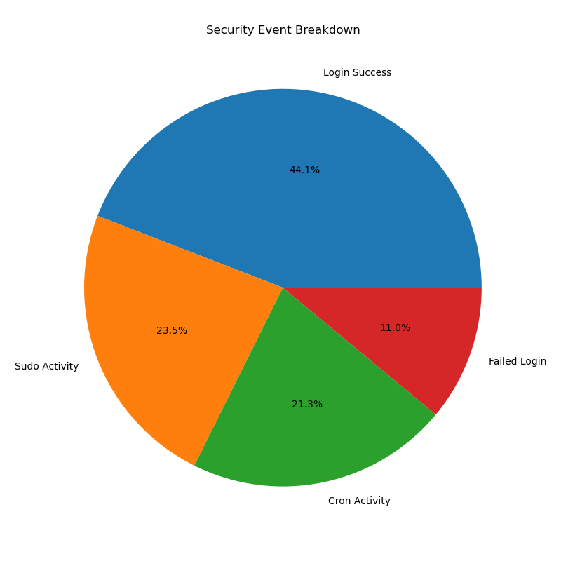
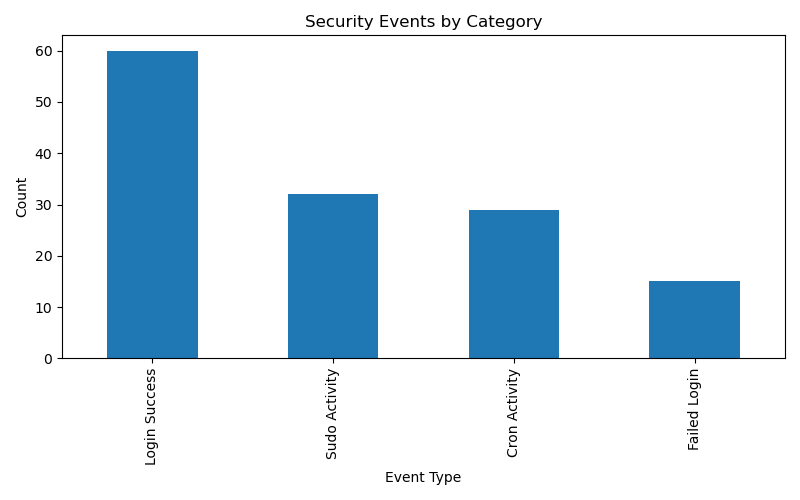
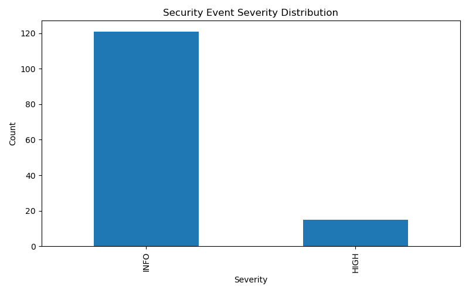

# SOC-LAB: Linux Log Analysis, Automation & SIEM Visualization

## Overview

SOC-LAB is a cybersecurity project focused on Linux authentication log analysis, security event detection, automation, and SIEM-style visualization. The project simulates a Security Operations Center (SOC) workflow by collecting authentication logs from a vulnerable Linux host, parsing security-relevant events, exporting structured data, generating alerts, and visualizing findings through dashboards.

The project was developed as part of a SOC Analyst learning journey and demonstrates log analysis, threat detection, event classification, reporting, and security visualization techniques.

---

##Project Highlights

* Collected and analyzed Linux authentication logs from a Metasploitable lab environment.
* Parsed and classified security-relevant events including failed logins, successful logins, sudo activity, and cron executions.
* Exported structured security events into JSON format for downstream processing.
* Built automated SIEM-style dashboards using Pandas and Matplotlib.
* Generated a formal SOC investigation report including MITRE ATT&CK mapping, IOC analysis, risk assessment, and recommendations.
* Organized evidence through 20 screenshots covering the complete attack-to-analysis workflow.

## Objectives

* Collect authentication logs from a Linux target system.
* Identify successful and failed authentication attempts.
* Detect suspicious login behavior.
* Parse and classify security events automatically.
* Export structured security events into JSON format.
* Generate visual dashboards for security monitoring.
* Produce a formal SOC investigation report.

---

## Lab Environment

### Analyst Workstation

* Kali Linux

### Target System

* Metasploitable 2
* IP Address: 192.168.56.20

### Network Architecture

Kali Linux → Log Collection → Parsing Engine → JSON Export → Visualization Dashboard

---

## Technologies Used

* Python 3
* Linux Authentication Logs
* Pandas
* Matplotlib
* SSH
* SCP
* VirtualBox
* Kali Linux
* Metasploitable 2

---

## Quick Start

### Clone Repository

```bash
git clone https://github.com/anoop-808/SentinelForge_v1.git
cd SentinelForge_v1
```

### Install Dependencies

```bash
pip install -r requirements.txt
```

### Run Log Parser

```bash
python3 scripts/parser_v2.py
```

### Generate Security Events

```bash
python3 scripts/json_export.py
```

### Generate Visualizations

```bash
python3 visualization/dashboard.py
```

### View Outputs

```bash
cat output/parser_output.txt
```

---

## Project Workflow

### Phase 1: Authentication Activity Generation

Security events were generated through:

* SSH logins
* Failed login attempts
* User enumeration attempts
* Sudo privilege escalation
* Cron activity

### Phase 2: Log Collection

Authentication logs were securely transferred from the target host for analysis.

### Phase 3: Log Parsing

Custom Python scripts extracted:

* Successful logins
* Failed logins
* Sudo activity
* Cron activity

### Phase 4: JSON Export

Parsed events were converted into structured JSON for downstream processing.

### Phase 5: Visualization

Security dashboards were generated using Pandas and Matplotlib to visualize:

* Event severity distribution
* Security event categories
* Security event breakdown

### Phase 6: SOC Reporting

A formal SOC investigation report was created, including:

* Event statistics
* MITRE ATT&CK mapping
* Indicators of Compromise (IOCs)
* Risk assessment
* Recommendations

---

## MITRE ATT&CK Mapping

## MITRE ATT&CK Mapping

| Security Activity | ATT&CK Technique |
|-------------------|------------------|
| Failed SSH Login Attempts | T1110.001 - Password Guessing |
| Multiple Failed Logins | T1110 - Brute Force |
| Successful SSH Authentication | T1078 - Valid Accounts |
| SSH Remote Access | T1021.004 - SSH |
| User Enumeration Attempts | T1087 - Account Discovery |
| Cron Job Execution | T1053.003 - Cron |
| Command Execution via Cron | T1059 - Command and Scripting Interpreter |

---

## Code Representation

## Parsing Logic Example

```python
if "Failed password" in line:
    print(line.strip())

elif "Accepted password" in line:
    print(line.strip())

elif "CRON" in line:
    print(line.strip())
```

The parser identifies authentication events and extracts security-relevant activity from Linux authentication logs.

---

## Repository Structure

```text
SOC-LAB/
├── logs/
├── output/
├── reports/
├── screenshots/
├── scripts/
├── visualization/
├── README.md
├── requirements.txt
└── .gitignore
```

---

## Dashboard Preview

### Event Breakdown



### Event Categories



### Severity Distribution



## Key Results

* Parsed Linux authentication logs.
* Detected failed authentication activity.
* Identified brute-force style login patterns.
* Exported security events into JSON.
* Generated security dashboards.
* Produced a professional SOC investigation report.

---

## Future Enhancements

- Real-time log monitoring
- Wazuh agent integration
- Automated alert generation
- IOC enrichment pipeline
- Sigma rule generation
- Threat hunting dashboards

---

## Author

B. Giri Anoop

SOC Analyst Student Project
